# Moneta Capital — Product Handoff & Roadmap

**Prepared for:** Emmanuel Entonu, Chief Engineer, Moneta Capital Investment Limited
**Date:** 15 July 2026
**Purpose:** Product map input — current feature inventory, known gaps, Friday native pilot scope, and post-launch roadmap for both the consumer app and the BaaS layer.

---

## TL;DR

- The demo **works end-to-end** against real PAC production — real accounts, real orders, real market data. Verified in the codebase and confirmed with live Vercel logs (order `0000061516` accepted by NGX 15 Jul).
- Two things are **manual by design of what PAC has exposed to us so far**: wallet funding and CSCS account issuance. Both need PAC to give us API surface — not blockers we can code around alone.
- Two things are **manual by our own choice/leftover state**: CACS form review (admin approval in-app) and Moneta card as a Trade payment source (gated off behind "Under Construction").
- **One critical security issue must be fixed before Friday:** Moneta merchant secrets (`VITE_MONETA_CLIENT_SECRET`, `VITE_MONETA_MAC_KEY`, wallet service key) are embedded in the browser JS bundle. Not PAC creds — PAC is correctly server-side.
- **Friday native ship is realistic as a controlled pilot** — signed native build of the current app, secret leak fixed, released to a small capped user group. Not a public launch. Public launch = 2–3 weeks after that, gated on the fix + a security pass + PAC's wallet-funding answer.

---

## Part 1 — Feature Inventory (what the demo does today)

### Authentication & session
- Email + password registration (Supabase Auth)
- Login, logout, session persistence
- Password reset via email
- Auto-refresh session on app resume

### Onboarding
- Welcome/onboarding screens
- Per-user "onboarded" flag stored locally
- Automatic routing: unonboarded → onboarding, unverified → KYC, no CACS → CACS submission

### KYC — 3-step flow
- **Step 1: BVN verification via Moneta NIBSS** — real BVN query → OTP sent to BVN-linked phone → OTP verify → returns full BVN profile (name, DOB, address, NIN)
- **Step 1 fallback:** "Skip BVN for now" (data collected but not verified — for demo continuity)
- **Step 2: ID selection** — Passport / Driver's Licence / NIN / Voter's Card
- **Step 3: ID document upload** — JPG/PNG/PDF, max 5MB, to Supabase Storage `kyc-docs`
- **PAC broker account creation** — real `POST /investing/api/v1/investment/accounts` at KYC completion, returns real PAC account ID stored in profile
- KYC gate: enforced before Trade route access

### CACS (CSCS registration) — currently manual
- User downloads CACS form (from app)
- Fills, uploads photo/scan to Supabase Storage `cacs-docs`
- Profile marked `cacs_status: 'pending'`
- Moneta admin reviews in `/admin` and flips to `approved` / `rejected` with reason
- CACS-approved gate: enforced before Trade route access
- Status widget on Portfolio shows current state

### Market data (all real, all PAC MDS)
- Live NGX All-Share Index with % change
- Market breadth (up / flat / down counts)
- Top gainers, top losers, most active
- 36 tracked equities with sparklines
- Search + category filter (All / Gainers / Losers / Banking / Cement…)
- Live price WebSocket updates
- `CLOSED` / `LIVE` badge based on market hours + WS status

### Trade (real orders via PAC)
- Full-screen stock detail: OHLV, live price, 1D/1W/1M/3M historical charts
- Compare against another stock (deep link)
- Market or Limit order type
- Buy or Sell toggle
- Quantity input + quick +1 / +10 buttons
- "Sell All" shortcut on sell side (uses current holding qty)
- Pre-trade fee validation from PAC (`/orders/validate`)
- Order confirmation sheet with breakdown
- Payment source picker (Wallet / Moneta card — Moneta currently gated 🚧)
- Order placement to PAC with idempotency header
- T+3 settlement banner on sell receipts
- Success receipt screen with polled balance update
- KYC gate + CACS gate modals if user attempts to trade without verification

### Portfolio
- Total portfolio value, cost basis, unrealized P&L, %
- Positions list with per-stock P&L and % ownership pie
- Live orders list (PAC-side) with status, fees, order number
- Cancel pending orders
- View fills for each order (execution history)
- Local orders history fallback (Supabase) when no PAC account linked
- Cash balance display
- Fund Wallet sheet (Moneta card / transfer / USSD)
- Quick amounts (₦5k / ₦10k / ₦25k / ₦50k / ₦100k)
- "Payment debited but wallet not updated?" recovery flow
- CACS status widget
- Broker link retry (if KYC succeeded but PAC account creation failed)

### Payments
- Moneta hosted checkout for card/transfer/USSD
- Payment callback verifies transaction via Moneta `/verify/reference`
- Retry logic (up to 5 attempts, 3s spacing)
- Credits Supabase wallet AND attempts to credit PAC sub-account
- Native custom-tab handling with `moneta://` deep-link scheme
- Pending order tied to payment — auto-places on payment success

### Profile & Settings
- Edit profile fields (name, phone, address, etc.)
- Read/write Supabase `profiles`
- Password change via email reset flow

### Admin panel
- CACS review queue
- Approve / reject with reason

### Native platform (Capacitor)
- Android scaffold present in repo (`android/`)
- iOS not yet scaffolded (config exists)
- Deep-link handler for `moneta://payment/callback` scheme
- Custom Tab / in-app browser support

---

## Part 2 — What's manual today and why

| Thing | Why it's manual | Owner to unblock |
|---|---|---|
| **Wallet funding** | PAC has not confirmed the `POST /investment/accounts/balance/{id}` endpoint actually credits the sub-account. Code calls it as best-effort, wrapped in a silent catch. In practice PAC offices credit accounts manually. | **PAC** — need confirmation of the funding endpoint's real behavior, or a documented alternative |
| **CSCS number issuance** | PAC has not exposed an API to create a CSCS trading account and return the number. Current workaround: user uploads filled CACS form, Moneta admin reviews manually. | **PAC** — need a `POST /cscs/create` endpoint (or equivalent) that takes KYC data and returns the CSCS number |
| **CACS form review** | Currently a human-in-the-loop step (Moneta admin approves in `/admin`). Even if PAC exposes CSCS API, some governance step may remain. | **Moneta** — decide if admin review stays or is replaced by automated CSCS create |
| **Moneta card on Trade** | Explicitly gated in the confirm sheet with "🚧 Under Construction". Reason unclear from code comments — likely IP whitelisting or a stability concern from prior testing. | **Moneta** (you) — investigate why it was gated, unblock if resolved |
| **Face verification in KYC** | Moneta has face liveness live but the demo only wires BVN + doc upload. Face step is not wired to any endpoint yet. | **Moneta** — provide face verification endpoint spec |

---

## Part 3 — Security state

### Confirmed safe
- **PAC credentials are server-side only.** `VITE_PAC_USERNAME` / `VITE_PAC_PASSWORD` are named with the `VITE_` prefix but are only referenced in `api/pac-proxy.ts` (Vercel serverless), never in `src/`. They are NOT embedded in the browser bundle.
- **Supabase RLS** enforces per-user data access on `profiles`, `orders`.
- **Idempotency key** sent on every order placement (`x-idempotency-id` header).
- **PAC daemon token** cached server-side with expiry, not exposed to client.

### Critical — must fix before Friday pilot
- **Moneta merchant secrets leak into the browser JS bundle.** Referenced in `src/lib/monetaApi.ts` with `import.meta.env.VITE_MONETA_*`:
  - `VITE_MONETA_CLIENT_ID`
  - `VITE_MONETA_CLIENT_SECRET`
  - `VITE_MONETA_WALLET_SERVICE_KEY`
  - `VITE_MONETA_MAC_KEY` ← HMAC signing key, most severe
  Anyone can pull these from devtools on the deployed site. Fix: move `getServiceToken`, `initializePayment`, `verifyPayment`, `generateHash` behind a new `api/moneta-charge.ts` serverless proxy. Client posts amount/email/type only; server signs and calls Moneta.
- **MDS API key hardcoded** as `?? 'deAaDavXQDFQNV7oUVZa'` fallback in both `api/mds-proxy.ts` and `src/store/portfolioStore.ts`. In git history. Needs rotation with MDS team.

### Watch items (not blocking Friday, must be resolved before public launch)
- Order idempotency uses `crypto.randomUUID()` per call — a client retry generates a new UUID, defeating dedup. Needs to be persistent per intent, not per attempt.
- Hardcoded PAC IDs (`clientId`, `productId`, `branchId`) at `src/lib/pacApi.ts:547-549` should read from env vars (`VITE_PAC_CLIENT_ID` etc.) which already exist in Vercel.
- No formal security review yet — recommended before real money flows at scale.
- No crash reporting / observability layer (Sentry, PostHog) in the native build yet.

---

## Part 4 — Friday native ship scope

**What ships:** a signed native Android build (iOS if time permits) of the current demo, secret-leak fixed, distributed as a controlled pilot to a capped user group.

**Realistic Friday punch list (in order):**

1. Fix Moneta secret leak — server-side proxy (0.5 day)
2. Rotate MDS API key with MDS team, remove hardcoded fallback (0.5 day)
3. Move hardcoded PAC IDs to env vars (0.25 day)
4. Enable Moneta card on Trade if it's actually working, otherwise leave gated (0.25 day)
5. Test full flow on native Android: register → KYC → CACS submit → fund wallet → buy → sell → portfolio (1 day)
6. Fix any deep-link / Custom Tab bugs surfaced in step 5 (0.5 day)
7. Add crash reporting (Sentry or similar) — non-negotiable for a pilot (0.5 day)
8. Sign the APK, publish internally / to pilot testers (0.25 day)

**What does NOT ship Friday:**
- Public launch / open registration
- Automated wallet funding (blocked on PAC)
- Automated CSCS issuance (blocked on PAC)
- Face verification (blocked on Moneta endpoint spec)
- BaaS API layer
- Halal screening integration
- iOS build (unless time permits)

**Framing for the meeting:** "Friday = signed native build of the working demo, released to a controlled pilot group, with the known security hole patched. Full public launch follows in 2–3 weeks after PAC answers on funding + CSCS APIs and a security pass."

---

## Part 5 — Post-Friday roadmap

### Wave 1 — Close the manual gaps (2–4 weeks)
- **Automate wallet funding** (assuming PAC unblocks) — real `depositToAccount` wired to Moneta payment confirmation, reconciliation job
- **Automate CSCS issuance** (assuming PAC unblocks) — replace CACS form download with an in-app data submission that hits PAC's create endpoint
- **In-app CACS interim** (if PAC delays) — move the form fully into the app (no download / no photo upload), still submit to Moneta admin for review, but reduce user friction
- **Face verification integration** — wire Moneta's face liveness endpoint into the KYC step 3
- **Persistent idempotency** on orders
- **Observability** — Sentry crash reporting, PostHog or similar for product analytics
- **iOS build**

### Wave 2 — BaaS foundation (4–8 weeks)
- OpenAPI spec for BaaS surface (contract-first)
- PAC adapter — internal interface wrapping every PAC call
- Partner auth (API keys)
- Per-partner end-user JWT scoping
- Endpoint groups: accounts, KYC, instruments, market data, orders, portfolio, wallet
- Refactor current web app to consume BaaS instead of `/api/pac-proxy` directly
- Native app also points at BaaS (not directly at PAC)
- Sandbox environment for partner testing
- Own ledger schema per partner
- Partner API docs (auto-generated from OpenAPI)

### Wave 3 — Halal + growth (2–3 months)
- Integrate the drafted halal screening TS module
- `/screening` endpoint + `halal` flag on instruments
- Compliant-universe view in the consumer app ("Halal Only" filter)
- Partner webhooks (fills, settlement)
- Ledger reconciliation with PAC (nightly)
- Withdrawal / settlement rails
- SEC compliance sign-off for public launch
- Partner onboarding flow

### Wave 4 — Scale (3–6 months)
- Additional NGX asset classes (fixed income, ETFs)
- Corporate actions / dividends
- Statement generation
- Order types beyond MARKET / LIMIT (stop, stop-limit)
- Multi-currency accounts if PAC supports
- Second-partner onboarding (first non-Moneta client of the BaaS)

---

## Part 6 — Questions to send PAC (blockers)

Before we commit dates on Wave 1, we need direct answers from PAC:

1. **Does `POST /investing/api/v1/investment/accounts/balance/{accountId}` actually credit the sub-account for real money?** Or is it a stub that requires PAC-side reconciliation? If reconciliation, what triggers it?
2. **Is there an API to open a CSCS trading account** and return the CSCS number after KYC data is provided? Or is CACS form submission the only path?
3. **Is there a sandbox tenant** we can hit for BaaS integration testing without touching production balances?
4. **What are rate limits** on the endpoints we're using (validate, place order, list orders)?
5. **Is the daemon token TTL configurable** or is 30 min the fixed value?
6. **What's the retention policy** on the Stoplight docs — is `mywealth-inc` still active, or has access moved somewhere else?
7. **Are corporate action / dividend / statement endpoints** available?
8. **Multi-tenant guidance** — is Moneta expected to use one master client account with sub-accounts per end-user (current pattern), or does PAC support isolated client accounts per BaaS partner?

---

## Part 7 — Questions to answer internally (Moneta)

1. **Face verification endpoint** — what's the REST spec / SDK integration path?
2. **Why is Moneta card gated on Trade?** Was it a whitelist issue that's now resolved, or a real bug?
3. **Merchant key rotation policy** — how do we rotate leaked keys and coordinate with the payment ops team?
4. **Ledger vs PAC as source of truth** — final call. Own ledger recommended for BaaS but has to be decided.
5. **API service stack for BaaS** — Node/TypeScript (matches demo) confirmed?
6. **Partner sandbox strategy** — separate deployment or same infrastructure with sandbox partner keys?
7. **Regulatory umbrella for BaaS partners** — do partner apps inherit Moneta's SEC license, or do they need their own?

---

## Part 8 — System diagrams

### Current architecture (as of 15 Jul 2026)

```mermaid
graph TB
    User[User's browser/Capacitor Android]
    Vercel[Vercel serverless functions]
    Supabase[(Supabase<br/>Auth + Postgres + Storage)]
    Fly[Fly.io static-IP proxy<br/>moneta-proxy.fly.dev]
    Fixie[Fixie static-IP proxy]
    PAC[PAC Wealthcare<br/>api.prod.mywealthcare.io]
    MDS[PAC MDS<br/>market data]
    MonetaPay[Moneta Payments<br/>api.moneta.ng]
    MonetaBVN[Moneta NIBSS BVN]

    User -->|auth, profiles, orders log| Supabase
    User -->|payments direct<br/>SECRETS LEAK HERE| Fly
    User -->|live prices WS| MDS
    User -->|orders, positions, KYC create| Vercel
    User -->|market data| Vercel

    Vercel -->|/api/pac-proxy| PAC
    Vercel -->|/api/mds-proxy| MDS
    Vercel -->|/api/nibss-bvn via Fixie| Fixie
    Fixie --> MonetaBVN

    Fly --> MonetaPay

    style Fly fill:#8b0000
    style User fill:#1a3a52
    style Vercel fill:#2d3748
    style PAC fill:#065f46
```

**Legend:** Red = Moneta secrets currently leak from client directly to `moneta-proxy.fly.dev`. Green = PAC (source of truth for trading). Grey = our infrastructure.

### Target architecture (BaaS ready, 8–12 weeks out)

```mermaid
graph TB
    Native[Moneta Native App<br/>iOS + Android]
    Web[Moneta Web App]
    Partner1[Partner App 1]
    PartnerN[Partner App N ...]
    BaaS[Moneta BaaS API<br/>api.moneta.dev/v1]
    Ledger[(Moneta Ledger<br/>own source of truth)]
    Halal[Halal Screening<br/>engine]
    PAC[PAC Wealthcare]
    MonetaSvc[Moneta internal:<br/>BVN + Face + Payments]

    Native -->|partner key + user JWT| BaaS
    Web -->|partner key + user JWT| BaaS
    Partner1 -->|partner key| BaaS
    PartnerN -->|partner key| BaaS

    BaaS --> Ledger
    BaaS --> Halal
    BaaS -->|PAC adapter<br/>master creds server-side| PAC
    BaaS -->|KYC + payments<br/>server-side creds| MonetaSvc

    style BaaS fill:#065f46
    style Ledger fill:#1e40af
    style PAC fill:#374151
    style MonetaSvc fill:#374151
```

**Key changes vs current:**
- No client ever sees PAC or Moneta credentials
- All partners (including Moneta's own apps) authenticate identically
- BaaS ledger is source of truth, reconciled with PAC
- Halal screening baked in
- Native + web + partner apps share one API surface

---

## Part 9 — Notes on the Claude 4.8 review

- **Framing Friday as a controlled pilot vs public launch — agree.** That's the right framing to give in the meeting.
- **"App must not hold PAC credentials" — already handled.** PAC creds live in `api/pac-proxy.ts` server-side. The demo does NOT ship PAC creds to the client. The security concern is misdirected at PAC — the actual leak is on the Moneta payment side (client secret + HMAC key in the bundle). That's the #1 Friday task.
- **"Funding needs PAC to expose a credit API" — partially agree.** The code already calls a funding endpoint at `/investment/accounts/balance/{id}`. What we don't know is whether that endpoint actually credits real money or if it's a stub PAC hasn't wired to their internal reconciliation. That's the direct question for PAC — not "does it exist" but "does it work in prod." Same for CSCS: PAC needs to confirm whether an issuance endpoint exists or is planned.
- **"Move CACS form fully in-app as interim win" — strong yes.** Even if PAC delays CSCS API, we can eliminate the download-refill-photograph-upload dance today. User fills fields in-app, we generate the form PDF server-side or submit structured data to Moneta admin. Ship that in Wave 1.

---

## Appendix A — Key file references

- `src/lib/pacApi.ts` — all PAC calls (this becomes the PAC adapter for the BaaS)
- `src/lib/monetaApi.ts` — Moneta payments (needs server-side move)
- `src/lib/nibssApi.ts` — BVN verification client
- `src/store/authStore.ts` — auth + profile state
- `src/store/portfolioStore.ts` — positions, orders, market data, WS
- `api/pac-proxy.ts` — PAC serverless proxy (auth-adds daemon token)
- `api/mds-proxy.ts` — market data serverless proxy
- `api/nibss-bvn.ts` — BVN serverless proxy (uses Fixie static IP)
- `api/moneta.ts` — orphaned Moneta passthrough (repurpose for secret-leak fix)
- `proxy/server.js` — Fly.io static-IP proxy (`moneta-proxy.fly.dev`)
- `supabase/setup.sql` — orders table + RLS
- `supabase/wallet_rpc.sql` — atomic wallet increment / decrement
- `MONETA_BVN_INTEGRATION_REPORT.md` — historical BVN integration notes
